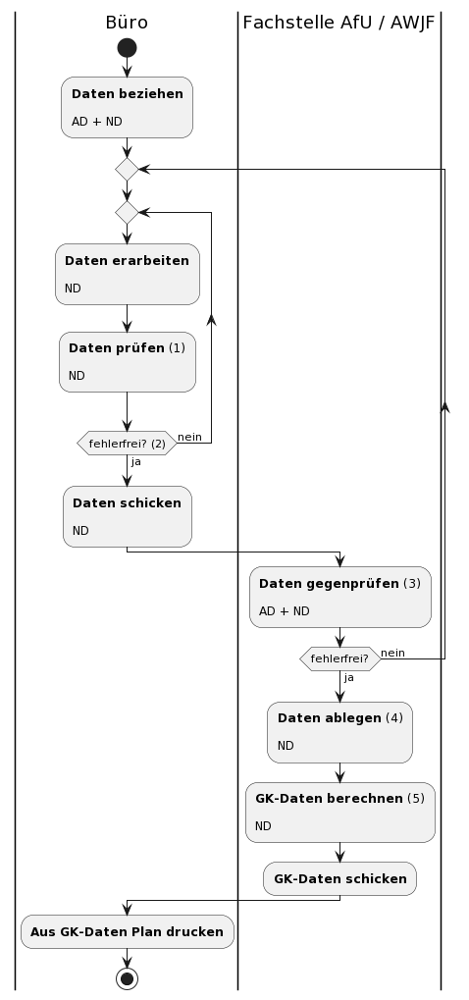
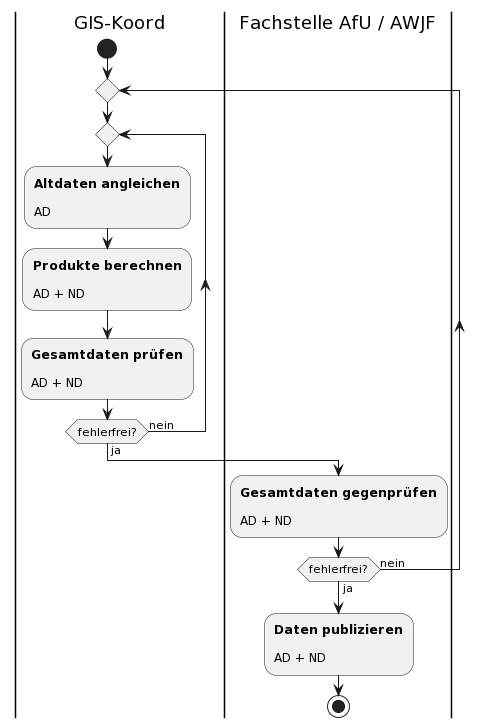

# Abläufe

Abbildung der Arbeitsschritte und Abläufe, welche einen Einfluss auf die Daten und oder Tools haben.

Zentral für das technische Verständnis ist der Umgang mit den bestehenden Altdaten. In den Aktiviäten sind die involvierten Daten jeweils wie folgt gekennzeichnet:

* AD: Altdaten (bestehend)
* ND: Neue Daten (gemäss neuem Erfassungs-Datenmodell)

Zu beantwortende Fragen sind mit f1, f2, ... gekennzeichnet

## Naturgefahrenbeurteilung (durch Gemeinde beauftragtes Büro)

### Bemerkungen / Fragen

* **(1):** Ein INTERLIS-Modell kann nie alle Prüf-Fälle abdecken. Darum muss im Büro eine visuelle Kontrolle erfolgen, möglichst im Vieraugenprinzip.
Die technische Prüfung gegen das Modell erfolgt mittels frei verfügbarer Prüf-Webseiten wie beispielsweise https://ilicop.ch/ 
* **(2):** Visuell und technisch!
* **(3):** Auch Gegenprüfung visuell und technisch.   
  * Frage: Sind für die Gegenprüfung Hinweise des Büros bezüglich der Altdaten notwendig?
* **(4):** Falls schon entsprechende Daten gemäss neuem Modell existieren, müssen diese beim Ablegen gelöscht werden.
* **(5):** Prozessquellenübergreifende Gefahrenkarte gemäss MGDM-Dokumentation Kapitel "3.3.6 Klasse synoptic_hazard_area" "Synoptik I"
  * Korrekt? Oder Klasse "hazard_area"?

## Angleich Altdaten (durch GIS-Koordinatoren AfU / AWJF)

